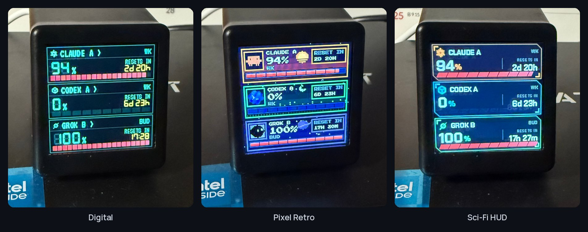
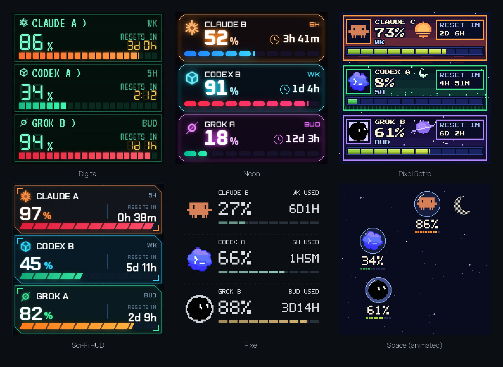
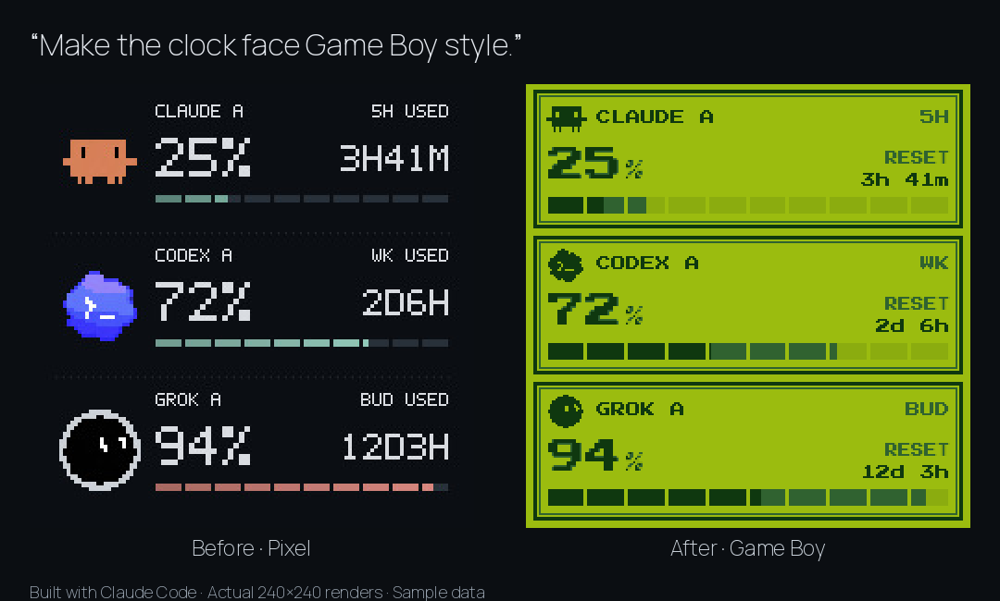

<h1 align="center">TokenTV</h1>

약 5달러 Wi-Fi 책상 시계에 Claude·Codex 사용 한도를 띄웁니다. 펌웨어는 그대로예요.  
**구경하기:** [라이브 데모](https://token-tv.vercel.app) 또는 `npx github:click6067-ship-it/token-tv demo`, 시계·로그인 없이 바로.  
**설치하기:** 이 저장소를 AI에게 주고 *"TokenTV 설정해줘"* 라고 하세요. AI는 [AGENTS.md](AGENTS.md)를 따릅니다.  
**내 화면 만들기:** 시계 없이 [Game Boy 예제](examples/gameboy)에서 시작해 AI에게 바꿔 달라고 하세요. [가이드](docs/clock-faces.md) · [공유하기](https://github.com/click6067-ship-it/token-tv/issues/new?template=share_a_face.md)  
자세히: [설정](docs/setup.ko.md) · [호환 시계](docs/hardware-compatibility.md) · MIT · [English](README.md)

