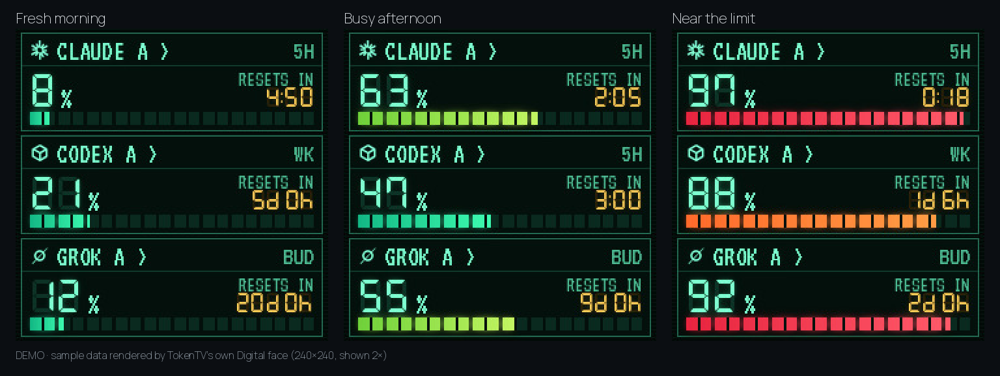

<h1 align="center">TokenTV</h1>

<p align="center"><b>Your AI limits, on a tiny desk clock</b><br>
Claude and Codex usage — multiple accounts — no firmware flashing<br>
<sub>Grok CLI budget: experimental. My clock cost about $5 on sale; prices and shipping vary. Needs a computer that stays on (the host).</sub></p>

<p align="center">
  <a href="https://token-tv.vercel.app"></a>
  <a href="#quick-start"></a>
  <a href="LICENSE"></a>
</p>

<p align="center"></p>

<p align="center"></p>

<p align="center"><a href="https://token-tv.vercel.app"></a></p>

<p align="center"></p>

## Quick start

Needs Python 3.10+ and the official CLI (`claude`, `codex` or `grok`) for each provider you use.

```bash
pipx install git+https://github.com/click6067-ship-it/token-tv   # or: pip install --user git+...
token-tv demo                                     # every clock face with sample data, no login
token-tv setup                                    # asks for emails (up to 3 per provider) and the clock IP
token-tv doctor --live                            # asks each provider now; says what is missing and the fix
token-tv run                                      # dashboard at http://127.0.0.1:8787, drives the clock
```

`uvx --from git+https://github.com/click6067-ship-it/token-tv token-tv demo` runs it without installing.
TokenTV is not on PyPI yet, so plain `uvx token-tv` does not work. From a clone, `pip install .`
gives the same `token-tv` command.

<p align="center"></p>

<details>
<summary><b>All six clock faces</b></summary>

<br>


Pick one under **Clock display** in the dashboard, then press **Apply to clock**. Space is an animated
GIF that the stock photo album plays; it is re-sent only when a number changes or every 30 minutes.
</details>

## Make it yours

**Start with a working face. Fork it, change it, show us yours.** A face is one Python function
that draws 240×240 pixels; [docs/clock-faces.md](docs/clock-faces.md) walks through it with sample
data, no clock or login needed. Your face runs from your own fork right away and shows up in the
dashboard's **Themes** list as *Local*.

Want others to use it? Open a pull request with the *New clock face* template. Shared faces appear in
**Themes** for everyone on the next release, sorted by **Popular** (👍 on each theme's GitHub issue)
or **New**. Likes are counted by hand before releases, so the list says when they were counted.

<details>
<summary><b>Hardware</b></summary>

- A GeekMagic **SmallTV**-style 240×240 Wi-Fi clock whose stock firmware has a photo album page.
  The author's cost ₩6,000 (about $5) on an AliExpress sale; prices vary.
- Any always-on machine on the same network with Python 3.10+ and the official CLIs you use.

The stock photo API (`/theme/list`, `/photo/list`, `/photo/upload`) is verified on the author's
clock. Clones with other firmware are untested.
See [docs/hardware-compatibility.md](docs/hardware-compatibility.md) for what is verified and how to check your clock.
</details>

<details>
<summary><b>How usage is read</b></summary>

| Provider | Source | The number means |
|---|---|---|
| Claude | Claude Code CLI's own OAuth login (profile and usage) | Share of the 5-hour and weekly limits **used** |
| Codex | Official `codex app-server` account and rate-limit RPC | Share of each reported window **used** |
| Grok | Grok CLI billing RPC (experimental) | Share of the CLI **billing budget**, not web chat limits |

Every login is checked against the email you configured. The clock gets only a picture,
never a password, token or cookie. Polling runs every five minutes; old readings say OLD and
missing data shows a dash, never a fake 0%. Claude accounts with `refresh_with_cli: true` may
refresh an expired login through the CLI, which sends one tiny prompt.
</details>

<details>
<summary><b>Accounts, clock and restore</b></summary>

- `setup` lets account A reuse the login you already have (`~/.claude`, `~/.codex`, `~/.grok`)
  and gives accounts B and C their own login folder under `~/.config/token-tv/homes/`.
  Non-interactive: repeat the flag, e.g. `token-tv setup --yes --codex-email a@x.com --codex-email b@x.com`;
  add `--isolate` to give account A its own folder too.
- `token-tv connect --account codex_b` logs a separate account in with its official CLI. It
  will not log in again over your everyday `~/.claude` / `~/.codex` login unless you type REPLACE.
- `token-tv doctor` only checks that login files exist. `doctor --live` runs the same check
  as the dashboard: it asks each provider for usage, may let the CLI refresh an expired login,
  and prints only a status per account, never a token.
- The config lives at `~/.config/token-tv/config.json`. `setup` never overwrites one, and
  every command takes `--config` for another path.
- The config holds aliases, emails and CLI home paths only. Never put passwords, API keys or
  tokens in it.
- Add `"device_url": "http://<clock-ip>"` to drive the clock.
- To give the clock back its original photo and theme, stop TokenTV and run
  `token-tv run --restore-display`.
- **macOS (untested on a real Mac):** Claude Code keeps its login in the Keychain, so TokenTV
  reads it there read-only with `security` when the CLI home has no `.credentials.json`.
  The login is still checked against the configured email. Codex and Grok read files as on Linux.
</details>

<details>
<summary><b>Status and contributing</b></summary>

Early and built for one desk: setup is `token-tv setup` plus CLI logins, it is tested on Linux with
one clock, and it supports Claude, Codex and Grok. A new provider is one payload function in
`token_tv/sources.py`. Issues and pull requests for providers, clock models and faces are welcome;
see [CONTRIBUTING.md](CONTRIBUTING.md) and [making a clock face](docs/clock-faces.md).
</details>

<details>
<summary><b>Development</b></summary>

```bash
pip install -e .
python3 -B -m unittest discover -s tests -v
python3 scripts/render_usage_examples.py   # docs/images/usage-examples.png
python3 scripts/render_clock_faces.py      # docs/images/clock-faces.png
python3 scripts/build_demo.py --out site   # the static live demo
```

`scripts/test_web_browser.cjs` runs the browser checks with a local Playwright Chromium.
</details>

MIT, see [LICENSE](LICENSE). Bundled fonts keep their SIL Open Font License notices in
`token_tv/web/`. · [한국어](README.ko.md)
