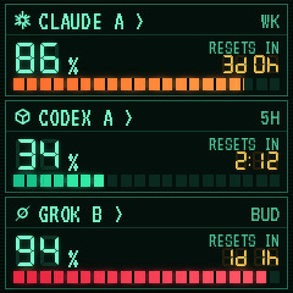
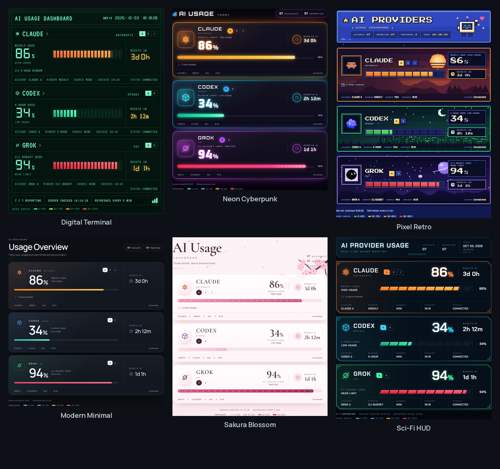

# TokenTV

**A $5 AliExpress weather clock, turned into a live usage meter for your AI subscriptions.**

Claude · Codex · Grok — several accounts per provider — no firmware flashing.

<p align="center">
  
</p>

TokenTV runs on a small always-on computer such as a mini PC or home server. It reads
how much of each subscription window you have used, draws a 240×240 picture and uploads
it to a GeekMagic SmallTV-style desk clock through the clock's own photo page. The clock
keeps its stock firmware and never receives a password, token or cookie.


## What you get

- **On the clock:** one account per provider, its most-used quota window, the time until
  that window resets, and a ten-cell gauge where each cell is 10%. The gauge colour changes
  as you approach the limit.
- **11 clock faces:** Digital, Neon, Pixel Retro, Modern, Sakura and Sci-Fi HUD, plus
  Pixel, Clean, Arcade, Columns and Orbit. Pick one from the web page.
- **A web dashboard** with six matching themes, every account (A/B/C…) and every reported
  window: 5-hour, weekly or CLI budget.
- **Several accounts per provider.** Each account keeps its own CLI login home, so a work
  and a personal Claude never mix.
- **Honest states.** Old readings are marked OLD, failed logins say so, and missing data
  shows a dash, never a fake 0%.



## Hardware

- A GeekMagic **SmallTV**-style 240×240 Wi-Fi desk clock whose stock firmware has a photo
  album page. The author's unit cost ₩6,000 (about $5) on an AliExpress sale; prices vary.
- Any always-on machine on the same network with Python 3.10+ and the official CLIs of the
  services you use.

The stock-firmware photo API (`/theme/list`, `/photo/list`, `/photo/upload`) is verified
on the author's clock. Clones with other firmware are untested.

## How usage is read

| Provider | Source | What the number means |
|---|---|---|
| Claude | The Claude Code CLI's own OAuth login (profile and usage) | Share of the 5-hour and weekly limits **used** |
| Codex | The official `codex app-server` account and rate-limit RPC | Share of each reported window **used** |
| Grok | The Grok CLI billing RPC (experimental) | Share of the CLI **billing budget** used, not web chat limits |

TokenTV checks that every login belongs to the email you configured and refuses CLI homes
that mix accounts. It polls every five minutes; opening the dashboard does not add requests.
Claude accounts with `refresh_with_cli: true` may refresh an expired login through the CLI,
which sends one tiny prompt.

## Quick start

```bash
git clone https://github.com/click6067-ship-it/token-tv && cd token-tv
python3 -m venv .venv && .venv/bin/pip install -r requirements.txt
mkdir -p .runtime && cp config.example.json .runtime/config.json
# Edit .runtime/config.json: one entry per account (alias, provider, email, CLI home).
# Add "device_url": "http://<clock-ip>" to drive the clock.
.venv/bin/python -m token_tv.live --config .runtime/config.json
```

Open `http://127.0.0.1:8787/`. Under **Clock display**, choose a face and press
**Apply to clock**.

Log each account in with its official CLI first. `python3 -m token_tv.connect --config
.runtime/config.json` walks you through it and keeps every account in its own CLI home.
The config holds aliases, emails and CLI home paths only. Never put passwords, API keys or
tokens in it.

To give the clock back its original photo and theme selection, stop TokenTV and run
`python3 -m token_tv.live --config .runtime/config.json --restore-display`.

## Status

Early and built for one desk:

- Setup is manual: a JSON file and CLI logins. There is no one-command installer yet.
- Developed and tested on Linux with one clock. Other platforms are untested.
- Claude, Codex and Grok only. A new provider is one payload function in
  `token_tv/sources.py`.

Issues and pull requests are welcome, especially new providers, clock models and faces.

## Development

```bash
python3 -B -m unittest discover -s tests -v
```

`scripts/test_web_browser.cjs` runs the browser checks with a local Playwright Chromium.

## License

MIT, see [LICENSE](LICENSE). Bundled fonts keep their SIL Open Font License notices in
`token_tv/web/`.

[한국어 README](README.ko.md)
