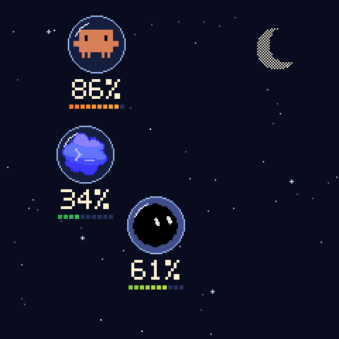
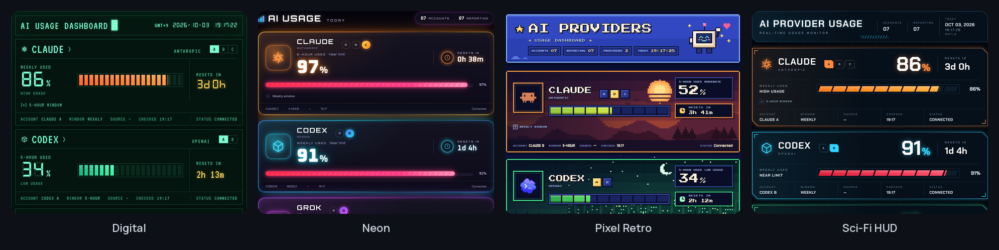
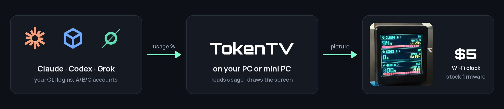

<h1 align="center">TokenTV</h1>

<p align="center"><b>Your AI usage limits on a $5 desk clock</b><br>
Claude · Codex · Grok — multiple accounts — no firmware flashing</p>

<p align="center">
  <a href="https://token-tv.vercel.app"></a>
  <a href="#quick-start"></a>
  <a href="LICENSE"></a>
</p>

<p align="center"></p>

<p align="center"></p>

<p align="center"><a href="https://token-tv.vercel.app"></a></p>

<p align="center"></p>

## Quick start

```bash
git clone https://github.com/click6067-ship-it/token-tv && cd token-tv
python3 -m venv .venv && .venv/bin/pip install -r requirements.txt
mkdir -p .runtime && cp config.example.json .runtime/config.json  # add accounts + clock IP
.venv/bin/python -m token_tv.live --config .runtime/config.json     # → localhost:8787
```

<details>
<summary><b>All six clock faces</b></summary>

<br>


Pick one under **Clock display** in the dashboard, then press **Apply to clock**. Space is an animated
GIF that the stock photo album plays; it is re-sent only when a number changes or every 30 minutes.
</details>

<details>
<summary><b>Hardware</b></summary>

- A GeekMagic **SmallTV**-style 240×240 Wi-Fi clock whose stock firmware has a photo album page.
  The author's cost ₩6,000 (about $5) on an AliExpress sale; prices vary.
- Any always-on machine on the same network with Python 3.10+ and the official CLIs you use.

The stock photo API (`/theme/list`, `/photo/list`, `/photo/upload`) is verified on the author's
clock. Clones with other firmware are untested.
</details>

<details>
<summary><b>How usage is read</b></summary>

| Provider | Source | The number means |
|---|---|---|
| Claude | Claude Code CLI's own OAuth login (profile and usage) | Share of the 5-hour and weekly limits **used** |
| Codex | Official `codex app-server` account and rate-limit RPC | Share of each reported window **used** |
| Grok | Grok CLI billing RPC (experimental) | Share of the CLI **billing budget**, not web chat limits |

Every login is checked against the email you configured. The clock gets only a picture,
never a password, token or cookie. Polling runs every five minutes; old readings say OLD and
missing data shows a dash, never a fake 0%. Claude accounts with `refresh_with_cli: true` may
refresh an expired login through the CLI, which sends one tiny prompt.
</details>

<details>
<summary><b>Accounts, clock and restore</b></summary>

- `python3 -m token_tv.connect --config .runtime/config.json` logs each account in with its
  official CLI and keeps every account in its own CLI home.
- The config holds aliases, emails and CLI home paths only. Never put passwords, API keys or
  tokens in it.
- Add `"device_url": "http://<clock-ip>"` to drive the clock.
- To give the clock back its original photo and theme, stop TokenTV and run
  `python3 -m token_tv.live --config .runtime/config.json --restore-display`.
</details>

<details>
<summary><b>Status and contributing</b></summary>

Early and built for one desk: setup is a JSON file plus CLI logins, it is tested on Linux with
one clock, and it supports Claude, Codex and Grok. A new provider is one payload function in
`token_tv/sources.py`. Issues and pull requests for providers, clock models and faces are welcome.
</details>

<details>
<summary><b>Development</b></summary>

```bash
python3 -B -m unittest discover -s tests -v
python3 scripts/build_demo.py --out site   # the static live demo
```

`scripts/test_web_browser.cjs` runs the browser checks with a local Playwright Chromium.
</details>

MIT, see [LICENSE](LICENSE). Bundled fonts keep their SIL Open Font License notices in
`token_tv/web/`. · [한국어](README.ko.md)
